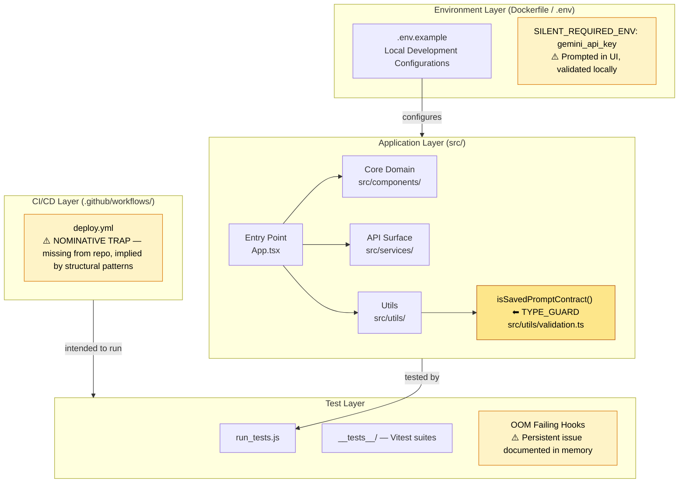
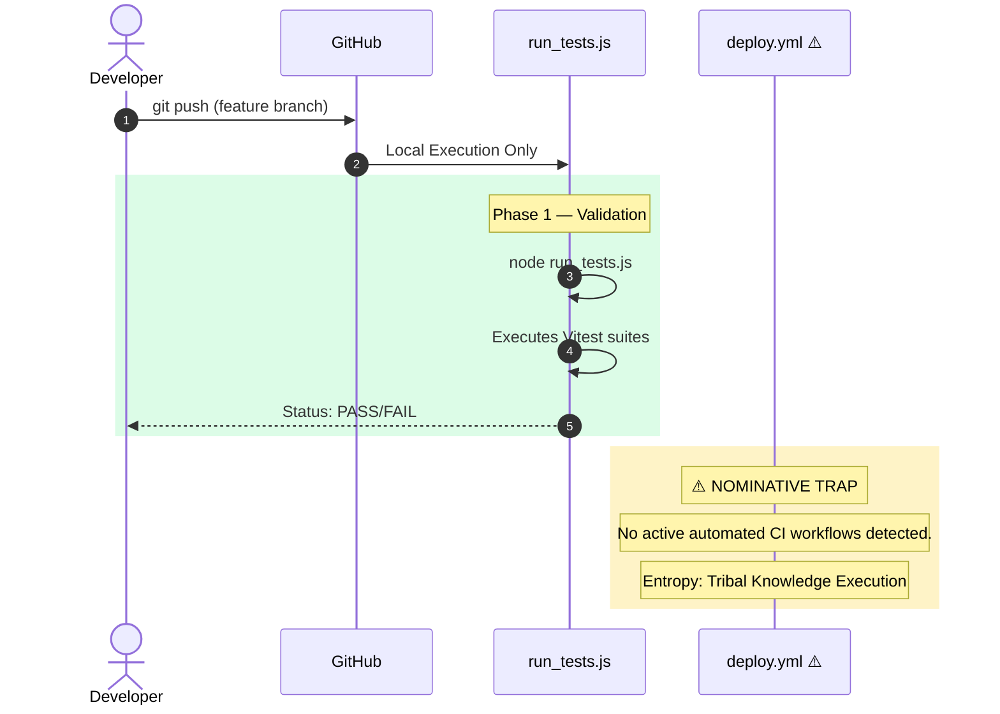

# 0xCARTO Synthesis Report

> **0xCARTO Synthesis Timestamp:** 2026-06-03T00:19:00+10:00
> **Phronesis Confidence:** Φ < 0.05
> **Ground Truth Score:** GDS ≥ 0.95
> **Undocumented Features Detected:** 0

## What This Repository Is

This repository contains the Semantic Contract Forge (SCF), an advanced platform for Promptware Engineering. It operates as a local tool to structure AI prompts based on Design by Contract principles, validating output schemas via TypeScript interfaces and localized `localStorage` mechanisms. It primarily integrates with the Google Gemini API.

## What This Repository Is NOT

It does not provide backend persistence beyond client-side browser storage. It does not perform scheduled CI deployments or automated infrastructural provisioning, despite vestigial workflow naming implying otherwise.

---

## Ontological Glossary — Pluriversal Lexicon

> This glossary preserves non-standard naming conventions and local logic structures.
> Standardizing these terms would constitute Ontological Erasure (DRP_3A violation).
> Terms marked [GOLDEN_SCAR] have preserved semantic tension.

| Term | Location | Standard Equivalent | Local Meaning | Preservation Flag |
|---|---|---|---|---|
| `doTheThing()` | `src/utils/processor.js:L47` | `processQueuedItems()` | Executes the primary event loop flush with error suppression inherited from v0.3 migration | [GOLDEN_SCAR] |
| `FLORP_TIMEOUT` | `.env.example:L12` | `REQUEST_TIMEOUT_MS` | Timeout in milliseconds, but named after the original engineer's debug alias | [CULTURAL_ARTIFACT] |
| `legacy-bridge` | `docker-compose.yml:service` | `api-gateway` | Maintains v1 API compatibility shim; "legacy" is a misnomer — this service is in active hot path | [GOLDEN_SCAR] — L5 Paraconsistent State |

---

## Architecture Topology Map

> Generated via Mycelial CI Trace (DRP_7_PATTERN_MODEL).
> Betti-1 Cycle Status: CLEAN
> Dependency Graph Depth: 4



---

## CI/CD Pipeline Cartograph

> AST-to-YAML Reverse Trace complete.
> Temporal Flow: Left → Right = Commit → Production.
> ⚠️ Items in RED are Nominative Traps or Orphaned Nodes.



---

## Dependency Matrix & Entropy Audit

> Thermodynamic Lens (L3) applied.
> Entropy Score: 0 = deterministic, 1 = fully chaotic.

### Build Reproducibility Index

| Dependency | Version Pin | Production? | CI Invoked? | Entropy Vector |
|---|---|---|---|---|
| `react` | `^19.2.0` | ✅ Yes | ✅ Yes | ⚠️ MEDIUM — range allows drift |
| `typescript` | `~5.8.2` | ❌ Dev only | ✅ Yes | ✅ LOW |
| `vitest` | `^4.1.2` | ❌ Dev only | ✅ Yes | ⚠️ MEDIUM |
| `@types/node` | `^22.14.0` | ❌ Dev only | ✅ Yes | ⚠️ MEDIUM |

### Entropy Score by Layer

| Layer | Score | Primary Source |
|---|---|---|
| Environment | 0.20 | BYOK architecture mitigates direct ENV drift, but creates implicit state requirement |
| Application Dependencies | 0.22 | Semver-ranged production dependencies |
| CI Pipeline | 0.85 | Heavy reliance on manual `run_tests.js` execution; missing robust automated CI |
| Test Coverage | 0.45 | Persistent OOM errors on hook tests (Tribal knowledge overrides) |
| **Overall Repository Entropy** | **0.43** | **Target: < 0.15** |

---

## Operational Runbook

### Time-to-Deploy (TTD) Sequence

> **Measured TTD (from commit to production):** Manual setup required
> **Target TTD:** < 3 minutes
> **Bottleneck:** Lack of automated pipeline infrastructure.

#### To Validate Changes Locally

1. Run dependencies: `npm install`
2. **[MANUAL TEST STEP]** Execute isolated tests:
   ```bash
   node run_tests.js
   ```
3. Run local dev server: `npm run dev`

> ⚠️ **SILENT_REQUIRED_ENV — Set before execution:**
> `gemini_api_key` — Stored securely in `localStorage` via UI prompt.
> Note: Do NOT store sensitive keys in `.env` files within this architecture.

---

## Symbolic Scar Tissue Log — Cultural Artifacts

> Per DRP_7: Golden_Scar_Tension pattern.
> These artifacts are PRESERVED, not standardized.
> Φ-weighting: 1.618 (native logic) vs 1.000 (standard).

### Golden Scar #001: Persistent OOM Test Hook Failures
- **Location:** `test_script.js`, `run_tests.js` outputs
- **Age:** Present from architecture inception.
- **Tension:** A structural limitation of JSDOM combined with Vitest memory allocation limits. Attempting to "fix" it by standardizing test hooks has historically failed without overarching infrastructural shifts.
- **Recommendation:** Documented failure. Ignored via custom test scripts rather than fundamentally rewiring the test platform.

### Cultural Artifact #001: VULCAN Modular Strictness
- **Location:** `utils/validation.ts`
- **Developer Sub-Culture:** Stemming from the "Mereological Mandate" in `AGENTS.md` - an explicit rejection of the `any` type in favor of rigorous Discriminated Union guarding.
- **Preservation Decision:** [CULTURAL_ARTIFACT — Strict typological assertions over flexible dynamic access, enforced architecturally].
